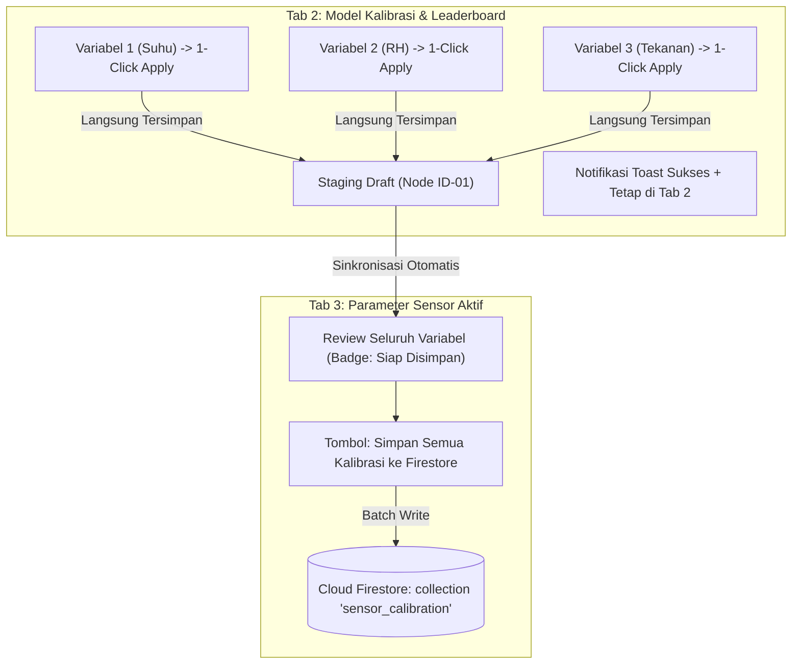

# Rencana Implementasi: Two-Phase Calibration Workflow (1-Click Staging & Centralized Firestore Commit)

## Ringkasan Kebutuhan Pengguna
Pengguna menginginkan perbaikan alur kalibrasi agar:
1. **Di Menu Kalibrasi & Validasi (Tab 1 & Tab 2)**:
   - Ketika meninjau Leaderboard Benchmark / Model Inspeksi untuk suatu variabel sensor (misal Suhu Udara), cukup menekan tombol **"1-Click Apply"** dan rumus kalibrasi untuk variabel tersebut **LANGSUNG TERSIMPAN** (ke dalam draft/staging stasiun aktif).
   - **TIDAK mental atau dipaksa pindah ke Tab 3**. Pengguna tetap berada di Tab Kalibrasi agar dapat langsung mengganti parameter lain (misal beralih ke Kelembapan, Tekanan, Curah Hujan, Kecepatan Angin) dan melakukan 1-Click Apply berturut-turut dengan cepat.
2. **Di Bagian Parameter Sensor Aktif (Tab 3)**:
   - Menjadi pusat konsolidasi (Centralized Staging & Commit Manager) yang menampilkan status seluruh variabel sensor pada stasiun yang telah diterapkan.
   - Menyediakan tombol utama untuk **MENYIMPAN SEMUA KALIBRASI** pada tiap variabel pada tiap node sensor ke **Firestore** secara definitif dan permanen.

---

## Masalah pada Alur Saat Ini
1. **Navigasi Terputus (Disruptive Redirection)**: Saat ini, `handle1ClickApply` di `app/dashboard/kalibrasi/page.tsx` memanggil `setActiveMainTab("sensor-settings")` yang secara paksa melempar pengguna ke Tab 3.
2. **Belum Ada Sistem Staging Multi-Variabel**: Hanya variabel yang baru diklik yang dimasukkan ke form Tab 3. Jika pengguna ingin mengalibrasi 5 variabel pada satu node, pengguna harus bolak-balik antar-tab 5 kali, dengan risiko nilai sebelumnya ter-reset.
3. **Belum Ada Indikator Perubahan**: Tab 3 tidak menunjukkan variabel mana yang baru saja dikalibrasi dari Tab 2 versus data yang sudah tersimpan di Firestore.

---

## Solusi Arsitektur: Pola Staging-to-Commit (Two-Phase Calibration)

---

## Proposed Changes

### 1. State Management Staging Kalibrasi
#### [MODIFY] [page.tsx](file:///d:/Github/Dashboard-Meteo-Sense/app/dashboard/kalibrasi/page.tsx)
- Menambahkan state `stagedCalibrations`: record dari `stationId` ke `Partial<StationCalibrationDocument>` dan metadata riwayat apply.
- Persistensi lokal otomatis (`localStorage.setItem("meteo_staged_calibration", ...)`) agar draft tidak hilang bila browser direfresh.
- Mengubah fungsi `handle1ClickApply`:
  - Menghitung parameter kalibrasi dengan `fitSensorCalibrationFromERA5`.
  - Memasukkan parameter variabel tersebut ke dalam `stagedCalibrations[selectedStationId]`.
  - **Meniadakan pemindahan tab otomatis** (`setActiveMainTab("sensor-settings")` dihapus dari alur otomatis).
  - Memberikan feedback visual seketika (Toast konfirmasi, highlight pada baris leaderboard).
- Menambahkan badge jumlah perubahan tertunda pada header Tab 3:
  Contoh: `<Badge className="bg-amber-500 text-white">3 Siap Simpan</Badge>`.
- Meneruskan data `stagedCalibrations` dan callback simpan ke komponen `ActiveSensorManager`.

### 2. Leaderboard Table Visual Feedback
#### [MODIFY] [MethodBenchmarkLeaderboard.tsx](file:///d:/Github/Dashboard-Meteo-Sense/components/calibration/MethodBenchmarkLeaderboard.tsx)
- Menambahkan properti `appliedMethod` untuk variabel aktif saat ini.
- Tombol "1-Click Apply" menampilkan feedback interaktif:
  - Berubah menjadi ikon checklist dan teks `Tersimpan!` selama 2 detik saat ditekan.
  - Baris metode yang sedang aktif dalam staging draft diberi penanda visual (misal badge `Aktif di Draft`).

### 3. Konsolidasi & Batch Commit di Parameter Sensor Aktif
#### [MODIFY] [ActiveSensorManager.tsx](file:///d:/Github/Dashboard-Meteo-Sense/components/calibration/ActiveSensorManager.tsx)
- Menerima `stagedCalibrations` untuk stasiun aktif.
- Menampilkan **Staging Review Banner** di bagian atas tab:
  - Menampilkan ringkasan variabel yang telah di-apply dari Leaderboard dan belum dikirim ke Firestore.
  - Menampilkan rumus/metode kalibrasi terpilih untuk masing-masing variabel.
- Memperbarui tombol **"Simpan ke Firestore"**:
  - Menyimpan seluruh konfigurasi 11 variabel untuk stasiun tersebut ke Firestore menggunakan `saveCalibrationDocument(stationId, completeDoc)`.
  - Membersihkan draft staging stasiun tersebut setelah sukses tersimpan.
  - Opsional: Menambahkan tombol "Simpan Seluruh Node yang Dikalibrasi" jika pengguna mengalibrasi lebih dari satu node sensor.

---

## Verification Plan

### Automated / Syntax Verification
- Memeriksa TypeScript compile check dan build integrity dengan `npm run build` atau running dev server check.
- Memastikan tidak ada schema mismatch antara `SensorVariableCalibrationSchema` dan payload staging.

### Manual Verification
1. Buka halaman `/dashboard/kalibrasi?tab=model-calibration`.
2. Pilih parameter **Suhu Udara (2m)** pada Node ID-01, klik **1-Click Apply** pada salah satu metode (misal Polynomial Regression):
   - Verifikasi: Toast muncul, tombol menunjukkan "Tersimpan", dan pengguna **tetap berada di Tab 2**.
3. Ganti parameter ke **Kelembapan Relatif (RH)**, klik **1-Click Apply** (misal Quantile Mapping):
   - Verifikasi: Pengguna tetap di Tab 2, dan badge Tab 3 kini menunjukkan angka `2 Siap Simpan`.
4. Ganti parameter ke **Tekanan Permukaan (P)**, klik **1-Click Apply** (Linear Regression):
   - Verifikasi: Badge Tab 3 bertambah menjadi `3 Siap Simpan`.
5. Pindah ke Tab 3 **"Parameter Sensor Aktif"**:
   - Verifikasi: Banner Staging menampilkan 3 variabel (Suhu, RH, Tekanan) beserta formula kalibrasinya.
   - Input formulir terisi otomatis sesuai nilai yang di-apply.
6. Klik tombol **"Simpan ke Firestore"**:
   - Verifikasi: Dokumen tersimpan ke Firestore koleksi `sensor_calibration` dokumen `id-01`.
   - Toast konfirmasi sukses muncul, dan badge staging bersih.
